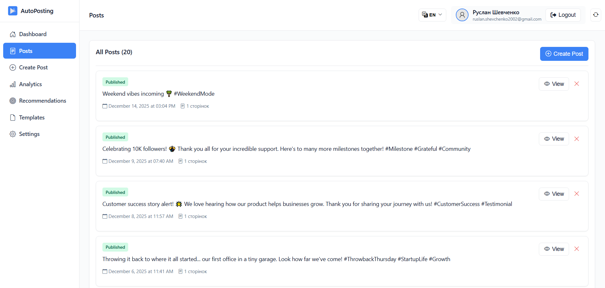
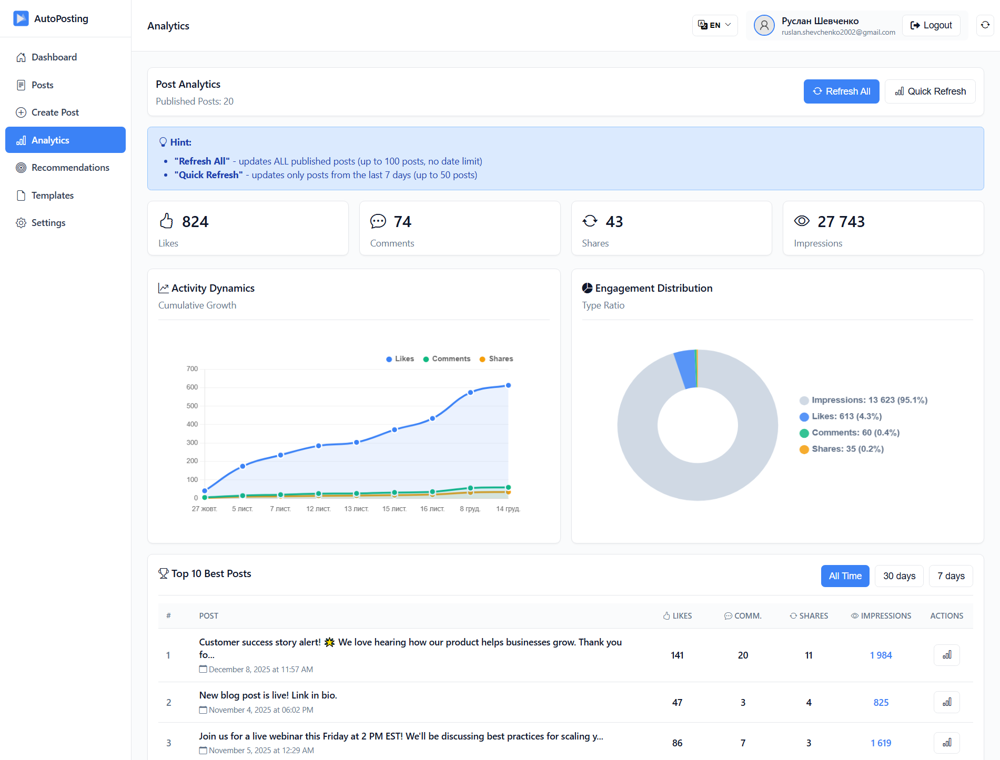
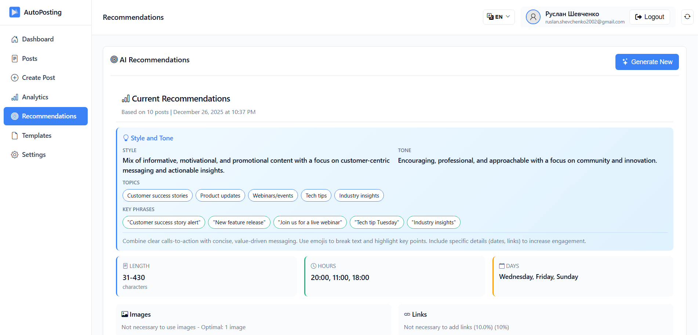
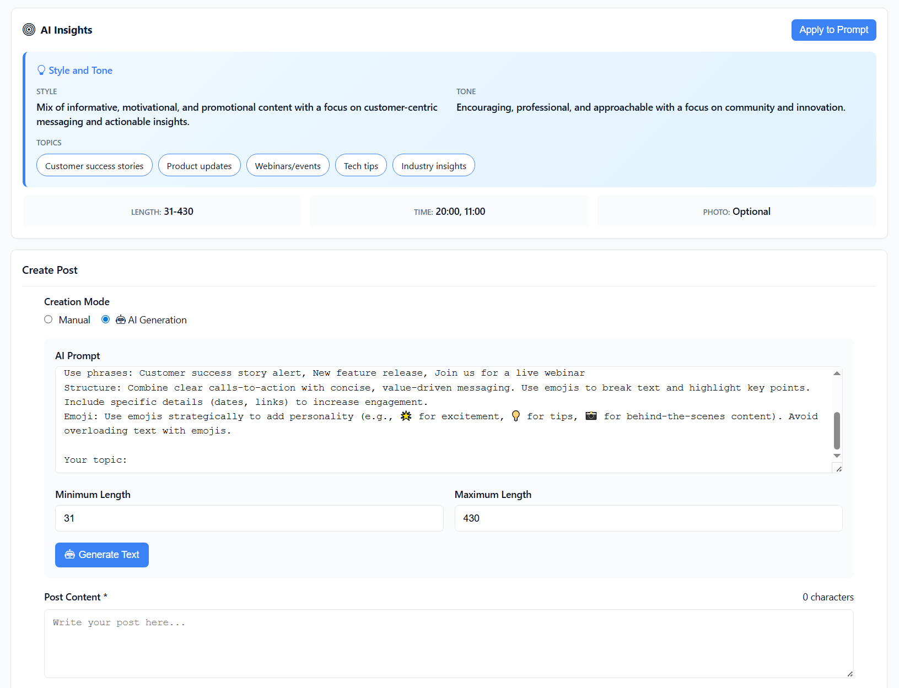

# AutoPosting - Automated Social Media Posting System

An integrated platform for automating social media publications with AI-powered content generation, intelligent scheduling, analytics collection, and performance-based recommendations for Facebook.

---

## Key Features

<p align="center">
  <br>
  <em>Posts management interface</em>
</p>

- **AI Content Generation**: Automated post creation using GPT4Free (free library)
- **Smart Scheduling**: Automated post publishing with customizable time slots
- **Analytics Dashboard**: Real-time metrics tracking (likes, comments, shares, impressions)
- **AI Recommendations**: Intelligent suggestions based on post performance analysis
- **Multi-language Support**: Ukrainian language content generation
- **Template System**: Reusable post templates for faster content creation
- **Google OAuth**: Secure user authentication
- **Facebook Integration**: Direct publishing to Facebook pages

---

## Technology Stack

**Backend:**
- Python 3.9+
- FastAPI
- SQLite
- Facebook Graph API
- GPT4Free (free AI library)

**Frontend:**
- HTML5/CSS3
- Vanilla JavaScript
- Responsive design

---

## Installation

### Prerequisites

- Python 3.9 or higher
- Facebook Developer Account
- Google Cloud Console Account

### 1. Clone Repository

```bash
git clone https://github.com/yourusername/automarketing.git
cd automarketing
```

### 2. Install Dependencies

```bash
pip install fastapi uvicorn python-multipart requests python-dotenv schedule apscheduler authlib httpx itsdangerous g4f
```

**Note:** The `g4f` (GPT4Free) library is free for non-commercial use. For commercial use, it is recommended to switch to official API services (OpenAI, Anthropic, etc.).

### 3. Facebook App Configuration

1. Go to [Facebook Developers](https://developers.facebook.com/)
2. Create a new app or use existing one
3. Add the following products:
   - **Facebook Login** - for user authentication
   - **Facebook Login for Business** - for automatic page authorization
4. Configure OAuth settings:
   - Valid OAuth Redirect URIs: `http://localhost:8000/auth/facebook/callback`
   - Add the following permissions:
     - `pages_show_list`
     - `pages_read_engagement`
     - `pages_manage_posts`
     - `pages_read_user_content`
     - `business_management` (for automatic authorization)
     - `publish_to_groups` (optional)

**Important:** Long-lived access token is generated automatically after first authorization in the system and stored in the database.

### 4. Google OAuth 2.0 Configuration

1. Go to [Google Cloud Console](https://console.cloud.google.com/)
2. Create a new project or select existing
3. Enable **Google+ API**
4. Create OAuth 2.0 credentials:
   - Application type: Web application
   - Authorized redirect URIs: `http://localhost:8000/auth/google/callback`
5. Download client configuration

### 5. Environment Configuration

Create `.env` file in project root:

```env
# Facebook API
FACEBOOK_APP_ID=your_facebook_app_id
FACEBOOK_APP_SECRET=your_facebook_app_secret

# Google OAuth
GOOGLE_CLIENT_ID=your_google_client_id
GOOGLE_CLIENT_SECRET=your_google_client_secret

# Application
SECRET_KEY=your_secret_key_for_sessions
BASE_URL=http://localhost:8000
```

**Note:** AI content generation works automatically through GPT4Free without additional configuration.

Generate a secure secret key:
```bash
python -c "import secrets; print(secrets.token_urlsafe(32))"
```

### 6. Initialize Database

The database will be created automatically on first run with the following schema:
- `users` - User accounts
- `facebook_pages` - Connected Facebook pages
- `posts` - Published and scheduled posts
- `analytics` - Post performance metrics
- `recommendations` - AI-generated suggestions
- `templates` - Reusable post templates
- `scheduler_tasks` - Background job tracking

### 7. Run Application

```bash
python api_server.py
```

The application will be available at `http://localhost:8000`

---

## Analytics Dashboard

<p align="center">
  <br>
  <em>Comprehensive analytics with engagement metrics and performance trends</em>
</p>

Track your social media performance:
- Total likes, comments, shares, and impressions
- Activity dynamics over time
- Engagement distribution by type
- Top 10 best-performing posts
- Time-based filtering (All Time, 30 days, 7 days)

---

## AI-Powered Recommendations

<p align="center">
  <br>
  <em>AI recommendations based on post performance analysis</em>
</p>

Get intelligent suggestions for:
- Optimal posting style and tone
- Best-performing topics and themes
- Recommended key phrases
- Ideal post length
- Best posting times
- Optimal posting days
- Image usage recommendations

---

## AI Content Generation

<p align="center">
  <br>
  <em>AI-powered post creation with customizable parameters</em>
</p>

Create engaging content automatically:
- Custom topic input
- Style and tone recommendations
- Suggested key phrases integration
- Adjustable length (31-430 characters)
- Real-time text generation
- Manual editing support

---

## Project Structure

```
automarketing/
├── api_server.py              # FastAPI application entry point
├── api_routes.py              # API endpoint definitions
├── api_models.py              # Pydantic data models
├── database.py                # Database operations
├── auth_facebook.py           # Facebook OAuth integration
├── auth_google.py             # Google OAuth integration
├── facebook_manager.py        # Facebook API operations
├── facebook_analytics.py      # Analytics data collection
├── text_generator.py          # AI content generation
├── analytics_recommender.py   # AI recommendation engine
├── scheduler.py               # Background task scheduler
├── frontend/
│   ├── index.html             # Main frontend interface
│   └── static/
│       ├── style.css          # Application styles
│       ├── app.js             # Main JavaScript logic
│       ├── auth.js            # Authentication handling
│       ├── api.js             # API communication
│       ├── pages.js           # Page management
│       ├── images.js          # Image upload handling
│       ├── charts.js          # Analytics visualization
│       └── i18n.js            # Internationalization
└── .env                       # Environment configuration
```

---

## Usage

1. **First Login**: Sign in with Google account
2. **Connect Facebook**: Authorize the app to access your Facebook pages
3. **Select Page**: Choose the Facebook page to manage
4. **Create Posts**: Use manual or AI-generated content
5. **Schedule**: Set publishing time or publish immediately
6. **Monitor Analytics**: Track post performance in real-time
7. **Get Recommendations**: Receive AI-powered optimization suggestions
8. **Use Templates**: Save and reuse successful post formats

---

## API Endpoints

### Authentication
- `GET /auth/google` - Initiate Google OAuth
- `GET /auth/google/callback` - Google OAuth callback
- `GET /auth/facebook` - Initiate Facebook OAuth
- `GET /auth/facebook/callback` - Facebook OAuth callback
- `POST /logout` - User logout

### Facebook Pages
- `GET /api/facebook-pages` - List connected pages
- `POST /api/select-page` - Select active page

### Posts
- `GET /api/posts` - Retrieve all posts
- `POST /api/posts` - Create new post
- `DELETE /api/posts/{post_id}` - Delete post

### Analytics
- `GET /api/analytics` - Fetch analytics data
- `POST /api/analytics/refresh` - Update analytics

### AI Features
- `POST /api/generate-text` - Generate post content
- `GET /api/recommendations` - Get AI recommendations
- `POST /api/recommendations/generate` - Create new recommendations

### Templates
- `GET /api/templates` - List templates
- `POST /api/templates` - Save template
- `DELETE /api/templates/{template_id}` - Delete template

---

## Security Notes

- All API credentials stored in `.env` file (not tracked in git)
- Session-based authentication with secure secret key
- OAuth 2.0 implementation for Facebook and Google
- Long-lived Facebook token is generated automatically after authorization
- HTTPS recommended for production deployment
- GPT4Free used for non-commercial purposes

---

## Deployment

For production deployment:

1. Use PostgreSQL instead of SQLite
2. Enable HTTPS with SSL certificates
3. Configure proper CORS settings
4. Set up process manager (PM2, systemd)
5. Use reverse proxy (Nginx, Apache)
6. Update OAuth redirect URIs
7. Set production environment variables
8. **Important:** For commercial use, replace GPT4Free with official APIs (OpenAI, Anthropic, Google AI, etc.)

---

## Limitations

- Facebook API rate limits apply
- Maximum 430 characters per generated post
- Analytics refresh limited to 100 posts per request
- Recommendations based on minimum 10 published posts

---

## License

This project is developed as part of a master's thesis at the National Aerospace University "Kharkiv Aviation Institute" (KhAI).

---
